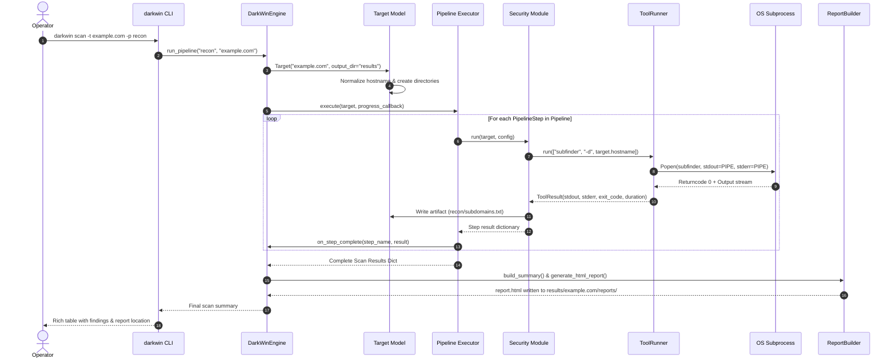

# DarkWin-AATK System Architecture & Design Specification

> In-depth engineering blueprint, data flow diagrams, concurrency model, and execution lifecycle of **DarkWin - Automated Attack Toolkit**.

---

## Table of Contents
1. [Architectural Overview](#1-architectural-overview)
2. [Component Model & Subsystems](#2-component-model--subsystems)
3. [Lifecycle of a Scan Execution](#3-lifecycle-of-a-scan-execution)
4. [Target State & Artifact Model](#4-target-state--artifact-model)
5. [Tool Runner & Subprocess Isolation](#5-tool-runner--subprocess-isolation)
6. [Pipeline Execution Engine](#6-pipeline-execution-engine)
7. [Telemetry, Logging & WebSocket Protocol](#7-telemetry-logging--websocket-protocol)
8. [Reporting Subsystem](#8-reporting-subsystem)

---

## 1. Architectural Overview

DarkWin-AATK follows a **modular pipeline-driven micro-kernel architecture**. Rather than reinventing low-level network scanners and security tools from scratch, DarkWin acts as a high-performance orchestration layer. It harmonizes diverse open-source offensive tools (written in Go, C, Python, Shell) with internal heuristics and produces consolidated, actionable security intelligence.

```
+-------------------------------------------------------------------------+
|                           Presentation Layer                            |
|     +-------------------------+         +-------------------------+     |
|     |       Click CLI         |         |     Flask + SocketIO    |     |
|     |       (Console)         |         |      Web Dashboard      |     |
|     +------------+------------+         +------------+------------+     |
+------------------|-----------------------------------|------------------+
                   v                                   v
+-------------------------------------------------------------------------+
|                         DarkWin Orchestrator                            |
|  +-------------------------------------------------------------------+  |
|  | DarkWinEngine (core/engine.py)                                    |  |
|  | - Target validation & directory initialization                   |  |
|  | - Pipeline selection & task scheduling                            |  |
|  | - Configuration ingestion (YAML + env overrides)                 |  |
|  +---------------------------------+---------------------------------+  |
|                                    |                                    |
|  +---------------------------------v---------------------------------+  |
|  | Pipeline DSL & Execution Manager (core/pipeline.py)               |  |
|  | - Step sequencer & dependency injection                          |  |
|  | - Fault tolerance & non-fatal step containment                   |  |
|  | - Timing, telemetry & progress notification                      |  |
|  +---------------------------------+---------------------------------+  |
+------------------------------------|------------------------------------+
                                     v
+-------------------------------------------------------------------------+
|                         Module & Tool Execution                         |
|  +-------------------------------------------------------------------+  |
|  | ToolRunner (core/tool_runner.py)                                  |  |
|  | - Subprocess lifecycle (stdin / stdout / stderr streaming)        |  |
|  | - Timeout enforcement & signal handling (SIGINT/SIGTERM)          |  |
|  | - Command-line piping (e.g. subfinder | httpx)                    |  |
|  +---------------------------------+---------------------------------+  |
|                                    |                                    |
|       +----------------------------+----------------------------+       |
|       |                            |                            |       |
|       v                            v                            v       |
|  +---------+                 +-----------+                 +---------+  |
|  |  Recon  |                 | Vulnerab. |                 | Exploits|  |
|  | Modules |                 |  Modules  |                 | Modules |  |
|  +---------+                 +-----------+                 +---------+  |
+------------------------------------|------------------------------------+
                                     v
+-------------------------------------------------------------------------+
|                        Data & Reporting Tier                            |
|  - Structured JSON findings                                             |
|  - Categorized raw artifact files (TXT, XML, JSON)                      |
|  - Jinja2 HTML Executive & Technical Reports                            |
+-------------------------------------------------------------------------+
```

---

## 2. Component Model & Subsystems

### 2.1 The Core Kernel (`core/`)
- **`darkwin.py`**: Interacts with the operator via CLI, parsing inputs, presenting flags, and routing commands to the engine.
- **`engine.py`**: Singleton-style controller coordinating config, tool loader, execution pipelines, and progress event dispatchers.
- **`pipeline.py`**: Orchestrates ordered pipelines composed of `PipelineStep` units.
- **`target.py`**: Object-oriented domain model for scan targets. Normalizes raw target strings and provisions isolated output trees.
- **`tool_runner.py`**: Subprocess abstraction wrapping external binaries with deterministic timeout boundaries, logging, and error capture.
- **`tool_loader.py`**: System audit helper that discovers installed binaries on `$PATH`.
- **`config_loader.py`**: Ingests, parses, and provides dot-notation access to `config.yaml`.
- **`logger.py`**: Configures multi-sink Loguru logging (file rotation + console).

### 2.2 Automation Pipelines (`automation/`)
High-level recipes binding discrete security modules into operational workflows:
- `ReconPipeline`: Focused on asset discovery and perimeter mapping.
- `FullScanPipeline`: Exhaustive lifecycle audit from recon to reporting.
- `BugBountyPipeline`: High-yield web vulnerabilities, URLs, parameters, and cloud assets.

### 2.3 Offensive Modules (`modules/`)
Self-contained Python modules implementing a standard contract:
```python
def run(target: Target, config: dict, **kwargs) -> dict:
    """Executes capability and returns structured result dictionary."""
```

---

## 3. Lifecycle of a Scan Execution



---

## 4. Target State & Artifact Model

DarkWin-AATK strictly separates execution outputs by target to eliminate race conditions and avoid cross-target data pollution.

### Target Normalization Algorithm
When a raw target is passed (e.g. `https://sub.domain.com:8443/login?q=1`):
1. **Scheme Extraction:** Identifies protocol (`http`, `https`, or `None`).
2. **Hostname Parsing:** Extracts FQDN (`sub.domain.com`) or IP address (`192.168.1.1`).
3. **Port Extraction:** Infers standard ports (`80`, `443`) or explicit port (`8443`).
4. **Target Classification:** Flags target as `domain`, `ip`, `cidr`, or `url`.
5. **Path Normalization:** Sanitizes target string into a filesystem-safe folder name (`sub.domain.com_8443`).

### Output Directory Hierarchy
```
results/<sanitized_target>/
|-- recon/             # DNS records, subdomains, WHOIS, ASN
|-- osint/             # Emails, breach records, metadata
|-- network/           # Port scan results, Nmap XML, service banners
|-- web/               # URLs, crawler trees, parameter inventories, JS dumps
|-- vulns/             # Nuclei matches, SQLi outputs, XSS PoCs, traversal files
|-- fuzzing/           # Ffuf outputs, directory lists, API fuzz logs
|-- exploitation/      # Exploit payloads, Metasploit session logs
|-- post_exploitation/ # LinPEAS/WinPEAS outputs, privilege audit logs
|-- loot/              # Extracted credentials, tokens, sensitive files
`-- reports/           # HTML executive report and JSON findings
```

---

## 5. Tool Runner & Subprocess Isolation

The `ToolRunner` class wraps OS-level subprocess management to guarantee safety, predictability, and detailed telemetry:

### Key Design Attributes
- **Explicit Timeouts:** Every command has an enforceable timeout boundary (default: 300s). Processes exceeding the threshold receive `SIGTERM`, followed by `SIGKILL` if unresponsive.
- **Environment Sanitation:** Execution runs within dedicated environment copies, allowing dynamic injection of custom `$PATH`, `$GOPATH`, or tool-specific API tokens without altering the system environment.
- **Typed Result Return:**
  ```python
  @dataclass
  class ToolResult:
      command: str
      exit_code: int
      stdout: str
      stderr: str
      duration: float
      success: bool
  ```
- **Live Stream Capture:** Captures real-time output line-by-line while simultaneously logging to disk and emitting updates to WebSocket subscribers.
- **Process Pipelining:** Supports executing chained UNIX pipes cleanly in Python across platforms (e.g. `cat targets.txt | httpx -silent | nuclei`).

---

## 6. Pipeline Execution Engine

The pipeline system utilizes a lightweight DSL:

```python
pipeline = Pipeline(name="Recon Pipeline")
pipeline.add_step("Subdomain Enumeration", subdomain_enum.run)
pipeline.add_step("DNS Resolution", dns_bruteforce.run)
pipeline.add_step("Port Scanning", port_scanner.run)
pipeline.add_step("Web Probing", crawler.run)
```

### Fault-Tolerance Model
- **Non-Fatal Failures:** A failure in an upstream step (e.g., WHOIS lookup rate-limited) does not abort downstream steps (e.g., port scanning).
- **Error Capture:** Exceptions in individual steps are caught, logged to the target error log, recorded in the `PipelineStep.error` field, and scan execution continues.
- **Context Propagation:** Intermediate files written to disk in one step serve as inputs for subsequent steps via standard `target.get_artifact_path()` paths.

---

## 7. Telemetry, Logging & WebSocket Protocol

### Structured Logging with Loguru
- **Console Sink:** Formatted, color-coded level tags with timestamp and module identification.
- **Target File Sink:** Dedicated `scan.log` written into the target's output directory with thread ID and function context for post-scan debugging.

### Real-Time WebSocket Telemetry
The dashboard backend streams live updates over Socket.IO:

#### Event: `scan_progress`
```json
{
  "target": "example.com",
  "pipeline": "recon",
  "step": "Subdomain Enumeration",
  "current_step": 1,
  "total_steps": 5,
  "percentage": 20,
  "status": "RUNNING"
}
```

#### Event: `tool_output`
```json
{
  "target": "example.com",
  "tool": "subfinder",
  "line": "[INF] Found 142 subdomains for example.com"
}
```

---

## 8. Reporting Subsystem

Reporting follows a decoupled builder pattern:

1. **`ReportBuilder`:** Modules add findings to the builder using standard severity classifications:
   - `CRITICAL` (CVSS 9.0 - 10.0)
   - `HIGH` (CVSS 7.0 - 8.9)
   - `MEDIUM` (CVSS 4.0 - 6.9)
   - `LOW` (CVSS 0.1 - 3.9)
   - `INFO` (CVSS 0.0)
2. **Jinja2 Template Engine:** Combines scan metadata, vulnerability counts, evidence logs, and remediation guidelines into [templates/report.html.j2](file:///c:/Users/vipha/Desktop/DarkWin-AATK/templates/report.html.j2).
3. **Dual Export:** Generates an interactive self-contained HTML report (viewable without external CDNs) alongside a machine-parseable `findings.json` artifact for CI/CD or SIEM ingestion.
