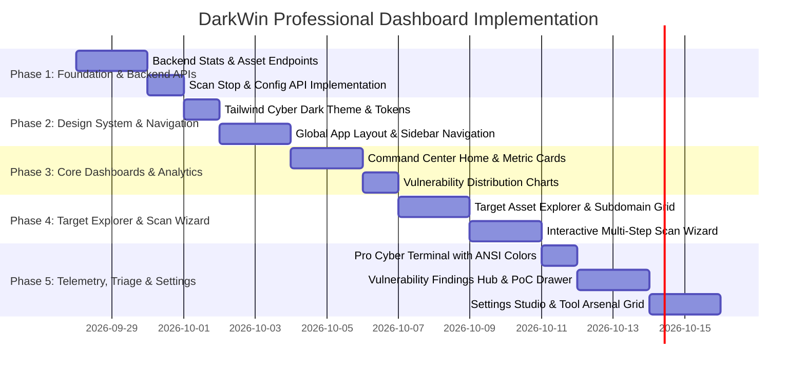

# DARKWIN-AATK: Professional Dashboard Blueprint & Implementation Plan

> **Architectural Specification & Development Roadmap for the Next-Generation Cybersecurity Command Center**  
> **Author:** ARYAN AHIRWAR (VIPHACKER.100)  
> **Target Release:** DarkWin Dashboard v2.0 (Next.js 16 + Tailwind CSS v4 + Flask-SocketIO)

---

## 1. Executive Summary & Design Vision

The current DarkWin dashboard provides essential real-time log streaming and target report viewing. However, modern offensive security operations (Red Teaming, Bug Bounty, and External Attack Surface Management) require a **centralized Command & Control (C2) style Security Operations Center (SOC)**.

### The Vision
Transform DarkWin from a simple log-viewer into an **elite, tactical offensive security dashboard**:
- **Design Aesthetic:** Cyber-tactical dark mode (`#0B0F17` background, `#0052FF` electric cobalt accents, neon severity badges, translucent glassmorphism cards, and JetBrains Mono monospace telemetry).
- **Architecture:** Clean Next.js 16 App Router architecture replacing the monolithic `page.tsx` with modular page routes, centralized global state, and reusable domain components.
- **Actionability:** From discovery to exploitation—launch targeted scans, filter thousands of subdomains, inspect live screenshots, triage vulnerabilities, review PoCs, and edit engine configurations visually.

---

## 2. Current State Analysis & Gap Assessment

### Current Architecture (`dashboard/`)
- **Backend:** `dashboard/backend/app.py` (Flask 3.x + Flask-SocketIO + Threading)
  - Endpoints: `/targets`, `/report/<target>/<session>`, `/status/<id>`, `/tools`, `/scan` (POST), `/scan/current`, `/scan/history`, `/target/<id>` (DELETE).
- **Frontend:** `dashboard/frontend/` (Next.js 16.2.10, React 19, Tailwind CSS v4, Framer Motion 11, Lucide React).

### Key Gaps Identified

| Area | Current State | Required Professional State |
|---|---|---|
| **Architecture** | Single 685-line `page.tsx` containing all logic | Modular Next.js App Router (`/`, `/targets`, `/vulnerabilities`, `/scans`, `/tools`, `/settings`) |
| **Theme & UI** | Minimalist light/grey theme with basic cards | Tactical cyber dark theme, glassmorphism, responsive collapsible navigation, command palette (`Ctrl+K`) |
| **Scan Control** | Basic text input + 3 pipeline options | Interactive Scan Wizard: Custom module selection, target scope, concurrency sliders, aggressive/stealth modes |
| **Target Management** | Flat list of session folder names | Rich Asset Tree: Subdomains, Open Ports, Services, Crawled URLs, Parameters, OSINT, and Cloud Storage |
| **Vulnerability Triage** | Only visible inside raw iframe reports | Dedicated Findings Hub: Filter by severity (Critical/High/Medium/Low), search by CVE/CWE, export to CSV/JSON |
| **Terminal & Logs** | Simple scrolling box | Pro Terminal: ANSI syntax highlighting, log level filters (`[+]`, `[-]`, `[!]`, `[*]`), regex search, pause/resume |
| **Tool Management** | Simple boolean list (Installed/Missing) | Interactive Tool Arsenal: Version detection, one-click installer triggers, wordlist status |
| **Configuration** | Manual editing of `core/config.yaml` | Visual Settings Studio: Manage API keys (GitHub, HIBP, Hunter.io), timeouts, user agents, proxy chains |

---

## 3. High-Level System Architecture

```
+---------------------------------------------------------------------------------------+
|                                DARKWIN FRONTEND (Next.js 16)                          |
|                                                                                       |
|  +--------------------+  +---------------------------------------------------------+  |
|  |  Navigation Dock   |  | Header Bar: System Health, Socket Pulse, Quick Scan     |  |
|  |  - Overview (Home) |  +---------------------------------------------------------+  |
|  |  - Targets & Assets|  | Dynamic Workspace Router                                |  |
|  |  - Vulnerabilities |  |                                                         |  |
|  |  - Live Scans      |  |  [/]           -> Analytics & Executive Metrics         |  |
|  |  - Terminal        |  |  [/targets]    -> Asset Explorer & Subdomain Grid       |  |
|  |  - Reports Studio  |  |  [/vulns]      -> Finding Triage & Evidence Viewer      |  |
|  |  - Tool Arsenal    |  |  [/terminal]   -> Fullscreen Telemetry & ANSI Stream    |  |
|  |  - Settings        |  |  [/settings]   -> Visual YAML & API Key Manager         |  |
|  +--------------------+  +---------------------------------------------------------+  |
+-------------------------------------------|-------------------------------------------+
                                            | REST API + WebSockets (Socket.IO)
                                            v
+---------------------------------------------------------------------------------------+
|                                DARKWIN BACKEND (Flask + Socket.IO)                    |
|                                                                                       |
|  +--------------------------+  +--------------------------+  +---------------------+  |
|  |   Scan Orchestrator      |  |   Target & Asset Parser  |  | Configuration API   |  |
|  |   - Thread pool manager  |  |   - JSON/TXT aggregator  |  | - Safe YAML parser  |  |
|  |   - Step progress bus    |  |   - Finding normalizer   |  | - Token sanitizer   |  |
|  +--------------------------+  +--------------------------+  +---------------------+  |
+-------------------------------------------|-------------------------------------------+
                                            v
+---------------------------------------------------------------------------------------+
|                                DARKWIN ENGINE & TARGET STORAGE                        |
|                                                                                       |
|   results/<target>/[recon | osint | web | network | vulns | reports | scan.log]       |
+---------------------------------------------------------------------------------------+
```

---

## 4. Feature Specifications & Modular Breakdown

### 4.1 Module 1: Executive Command Center (`app/page.tsx`)
- **KPI Metrics Cards:**
  - Total Targets Monitored (with trend indicator)
  - Active Scans Running (with pulsing radar badge)
  - Total Discovered Assets (Subdomains + Live Endpoints + Open Ports)
  - Critical/High Vulnerabilities requiring immediate attention
- **Interactive Visualizations:**
  - **Vulnerability Breakdown:** Donut/Bar chart (Critical 🔴, High 🟠, Medium 🟡, Low 🔵, Info ⚪)
  - **Scan Velocity & Activity:** Timeline of recent scans and completion rates
  - **Tool Arsenal Status Pill:** Displays `28/30 Tools Ready` with immediate warning if key tools are missing
- **Quick Scan Launcher:** Elevated instant-scan bar allowing 1-click execution right from the header.

### 4.2 Module 2: Target & Asset Intelligence Explorer (`app/targets/`)
A comprehensive asset inventory per target:
- **Subdomain Grid:**
  - Columns: FQDN, IP Address, HTTP Status Code (`200 OK`, `403 Forbidden`, `302 Redirect`), Web Server/Technologies (detected via HTTPX), Response Time.
  - Actions: Search, filter by status code, bulk copy, export as `.txt`/`.csv`.
- **Network Ports & Services Tab:**
  - Interactive port map: Port number, Protocol (`tcp`/`udp`), Service (`http`, `ssh`, `smb`, `ftp`), Product Version, Nmap NSE vulnerability notes.
- **Web Surface & Endpoints Tab:**
  - Searchable list of crawled URLs, query parameters discovered by `katana`/`gau`, and sensitive endpoints.
- **OSINT & Intelligence Tab:**
  - Discovered corporate email addresses, breached accounts, document metadata, and social media handles.
- **Cloud Perimeter Tab:**
  - Exposed S3 buckets, Azure blob storage, and GCP assets with permission status (Public/Private).
- **Raw Files Browser:**
  - Direct explorer to view and download any artifact in `results/<target>/` (`whois.json`, `dns_records.json`, etc.).

### 4.3 Module 3: Vulnerability & Findings Center (`app/vulnerabilities/`)
A unified security triage interface:
- **Filterable Findings Table:**
  - Severity Badges: `CRITICAL` (CVSS 9+), `HIGH` (CVSS 7-8.9), `MEDIUM` (CVSS 4-6.9), `LOW`, `INFO`.
  - Columns: Vulnerability Title, Affected Target/URL, Category (XSS, SQLi, SSRF, Misconfig, Nuclei), Timestamp, Status (`Open`, `Verified`, `False Positive`).
- **Deep Finding Drawer / Modal:**
  - Full vulnerability description and technical impact.
  - Complete reproduction Proof-of-Concept (curl command, HTTP request/response diff).
  - Remediation guidance and links to OWASP / CWE references.
  - "Mark as Resolved" or "Export PoC" actions.

### 4.4 Module 4: Advanced Scan Orchestrator (`components/scan-wizard/`)
A high-powered scan launch modal:
- **Target Specification:** Single domain, IP address, CIDR subnet, or bulk upload file.
- **Pipeline Selection:**
  - Preset 1: `Fast Reconnaissance` (Subdomains + Port scan + Live HTTP)
  - Preset 2: `Bug Bounty Sweep` (Recon + Historical URLs + Parameter Fuzzing + XSS/SQLi)
  - Preset 3: `Full Penetration Test` (End-to-End all vectors + Exploitation checks + Report)
  - Preset 4: `Custom Modular Scan`: Checkboxes to selectively enable/disable specific modules (e.g., skip brute-forcing, only run Nuclei).
- **Execution Tuning:**
  - Concurrency slider (threads: 5 to 50)
  - Timeout thresholds
  - Custom User-Agent string
  - Rate limiting / delay between requests
- **Live Launch:** Emits scan start, registers session, and automatically transitions to the live telemetry view.

### 4.5 Module 5: Real-Time Cyber Terminal (`app/terminal/`)
Tactical console interface:
- **Live Telemetry Stream:** Consumes WebSocket `scan_update` events with near-zero latency.
- **ANSI Color Support:** Renders colored terminal outputs (`\033[32m[+]\033[0m`, `\033[31m[-]\033[0m`, `\033[33m[!]\033[0m`) authentically.
- **Filtering & Search:** Real-time filter by log level (`INFO`, `WARN`, `ERROR`, `SUCCESS`) or regex search.
- **Controls:** Auto-scroll toggle, clear screen, download full session log, full-screen expansion toggle.

### 4.6 Module 6: Tool Arsenal & Environment Manager (`app/tools/`)
- Health matrix for all 30+ external tools:
  - Binary name, category, detected path, version string, installation status.
  - "Run Diagnostics" button to re-audit environment.
  - "Install Missing Tools" button (invokes background installer script).
  - SecLists & Wordlist storage status (presence, size, update date).

### 4.7 Module 7: Visual Configuration Studio (`app/settings/`)
- Clean visual form mapping to `core/config.yaml`:
  - **API Keys:** Secure password-style fields for GitHub Personal Access Token, HaveIBeenPwned API Key, Hunter.io Key, Shodan API Key, etc.
  - **Network & Scanner Profiles:** Default port lists, rate limits, Nmap timing profiles (`-T3`, `-T4`).
  - **Notification Integrations:** Webhook URL inputs for Discord, Slack, or Telegram alerts on scan completion or Critical findings.

---

## 5. Technical Stack & UI Design System

### Technology Stack
- **Framework:** Next.js 16 (React 19, TypeScript 5)
- **Styling:** Vanilla Tailwind CSS v4 with custom cyber tokens
- **Animations:** Framer Motion 11 (smooth tab transitions, drawer slides, pulse glows)
- **Icons:** Lucide React
- **Data Visualization:** Recharts (responsive SVG charts with custom dark tooltips)
- **Real-time Networking:** Socket.IO Client 4.7
- **HTTP Client:** Axios with centralized error and auth interceptors

### Cyber Design Tokens (`globals.css`)
```css
:root {
  --bg-primary: #07090E;         /* Deep void black */
  --bg-secondary: #0D121D;       /* Elevated dark slate */
  --bg-surface: #141B2B;         /* Card & modal container */
  --border-subtle: #1F2A3F;      /* Clean structural divider */
  --border-glow: rgba(0, 82, 255, 0.3);

  --accent-electric: #0052FF;    /* DarkWin brand cobalt */
  --accent-cyan: #00F0FF;        /* Telemetry cyan */
  --accent-glow: rgba(0, 82, 255, 0.25);

  --severity-critical: #FF0055;  /* Neon Crimson */
  --severity-high: #FF6600;      /* Electric Orange */
  --severity-medium: #FFB700;    /* Amber */
  --severity-low: #00B4D8;       /* Cerulean */
  --severity-info: #6C757D;      /* Slate Gray */
  --status-success: #00E676;     /* Neon Mint */
}
```

---

## 6. Backend API Enhancements (`dashboard/backend/app.py`)

To support these advanced features, we will extend the Flask backend with the following REST endpoints:

| Endpoint | Method | Description |
|---|---|---|
| `/api/stats` | `GET` | Aggregated dashboard metrics (targets count, vuln counts by severity, active scans) |
| `/api/targets/<target>/assets` | `GET` | Structured asset inventory (subdomains, ports, URLs parsed from target artifacts) |
| `/api/targets/<target>/vulns` | `GET` | Normalized list of findings across all scan sessions for a target |
| `/api/scan/stop` | `POST` | Safely abort an active running scan process |
| `/api/config` | `GET` | Read current `core/config.yaml` settings (with API tokens masked) |
| `/api/config` | `POST`| Safely validate and save updated configuration values |
| `/api/tools/install` | `POST`| Trigger background execution of `scripts/install_tools.sh` |

---

## 7. Step-by-Step Implementation Roadmap



### Detailed Phase Breakdown

#### Phase 1: Backend API Expansion (`dashboard/backend/app.py`)
1. Implement artifact parsers that read `results/<target>/` JSON and text files and return structured JSON schemas.
2. Add `/api/stats` endpoint returning pre-calculated metrics for instant page loads.
3. Add `/api/scan/stop` supporting graceful termination of active `ToolRunner` subprocesses.
4. Add `/api/config` GET/POST routes to read and write YAML settings safely.

#### Phase 2: Design System & Next.js App Router Structure
1. Reorganize `dashboard/frontend/app/` into modular routes:
   - `app/layout.tsx` (Root shell with persistent Sidebar, Header, and WebSocket provider)
   - `app/page.tsx` (Command Center & Analytics)
   - `app/targets/page.tsx` & `app/targets/[id]/page.tsx` (Asset & Target Explorer)
   - `app/vulnerabilities/page.tsx` (Findings Hub)
   - `app/terminal/page.tsx` (Dedicated Telemetry Console)
   - `app/tools/page.tsx` (Tool Arsenal Health)
   - `app/settings/page.tsx` (Config Studio)
2. Implement tactical dark theme variables and custom scrollbar styling in `globals.css`.

#### Phase 3: Command Center & Analytics
1. Build KPI metric cards with Framer Motion entry animations.
2. Integrate Recharts for real-time vulnerability distribution donut charts.
3. Build active scan tracker card with animated phase progress bars.

#### Phase 4: Target Asset Explorer & Scan Wizard
1. Implement searchable, filterable data tables for Subdomains, Open Ports, and Crawled Endpoints.
2. Build the Scan Wizard modal supporting pipeline selection, concurrency sliders, and targeted module toggles.

#### Phase 5: Findings Hub, Pro Terminal & Settings
1. Build the Vulnerability Drawer displaying PoCs, request/response dumps, and remediation steps.
2. Upgrade Terminal component to decode ANSI escape sequences and support real-time level filtering (`[+]`, `[-]`, `[!]`).
3. Build Visual Config Studio for API keys and engine tuning.

---

## 8. Success Metrics & Verification

The new dashboard will be evaluated against:
1. **Performance:** Instant navigation transitions (<100ms) with client-side caching.
2. **Telemetry Responsiveness:** Live terminal streaming logs within 50ms of subprocess emission.
3. **Data Completeness:** 100% of artifacts generated in `results/<target>/` accessible and searchable in the UI.
4. **Visual Excellence:** Clean, dark cyber aesthetic suitable for professional presentations, red team debriefs, and executive demonstrations.
